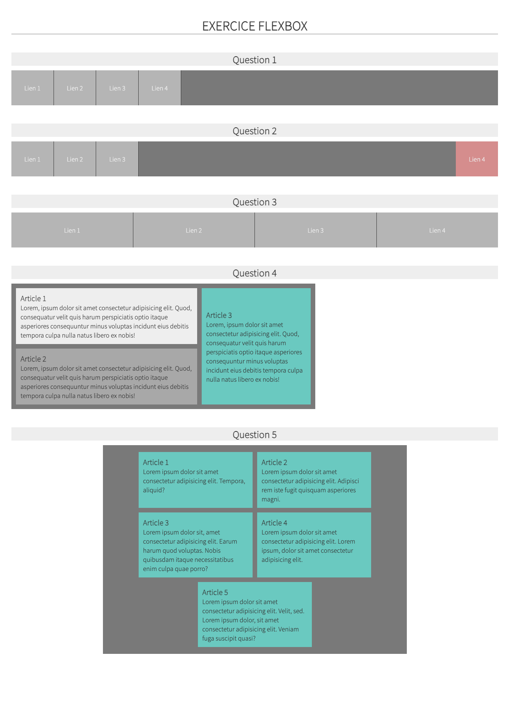

# Exercice flexbox

## Consignes
1. Reproduire la maquette suivante en utilisant les flexbox.

1. Travailler dans le fichier `_exercice.scss`.
2. Les détails se trouvent en commentaires dans le fichier `_exercice.scss`.
3. Vous pouvez imbriquer les règles ou non. C'est à votre discrétion.
   